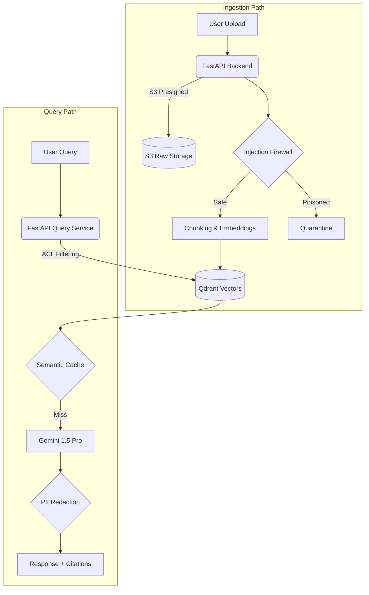

# VaultRAG
**The ultimate zero-trust, multi-tenant enterprise RAG platform with built-in cryptographic audibility and strict PII isolation.**

## 1. The Problem
Enterprise AI adoption is stalled by major security and compliance risks. VaultRAG solves the core problems of typical LLM implementations:
- **Data Leaks:** Users accidentally accessing highly sensitive cross-tenant or out-of-role documents.
- **Wrong Person Sees Documents:** Inadequate Role-Based Access Control (RBAC) allowing unauthorized visibility.
- **Poisoned Files:** Attackers uploading malicious documents to execute prompt injection and exfiltrate data.
- **Hallucinations:** AI confidently generating incorrect answers without backing sources or declining to answer.
- **No Audit / Proof of Deletion:** Inability to mathematically prove to GDPR/CCPA auditors that sensitive data and vectors were permanently deleted.

## 2. What VaultRAG Does
| Feature | Description |
|---|---|
| **Multi-tenant RAG** | Strict logical separation of vector namespaces and document storage per tenant. |
| **PII Guard** | Real-time detection and redaction of sensitive entities (SSN, credit cards) before LLM generation. |
| **Document-Level Access Control** | Attribute-based access control (ABAC/RBAC) filtering vectors seamlessly at query time. |
| **Injection Firewall** | Heuristic scanners that quarantine poisoned documents and block malicious injection queries. |
| **Grounded Cited Answers (with Abstain)** | Strict faithfulness scoring that forces the AI to abstain (0%) if the answer isn't firmly in the source text. |
| **Tamper-Evident Audit Log** | A blockchain-style cryptographic hashchain ledger recording every query, ingestion, and deletion. |
| **Erasure Certificate** | Generates an immutable, HMAC-signed JSON receipt mathematically proving complete vector and file deletion. |
| **Knowledge-Gap Analytics** | Tracks failed queries and abstentions to help admins identify missing documentation. |
| **Scope-Safe Semantic Cache** | Caches responses purely within a user's exact ACL boundaries to prevent cross-contamination. |
| **Evaluation Harness** | Built-in offline testing framework to simulate threat scenarios (ACL leaks, prompt injection). |
| **Admin Trust Center** | A dedicated governance dashboard for monitoring telemetry, auditing, and managing security policies. |
| **Scope Selector** | Allows users to forcefully narrow their query search scope to a single specific document. |
| **Assurance Center** | Automated red-team matrix testing that continuously validates tenant isolation and access controls. |
| **Saved Conversations** | Fully private, multi-turn conversational history stored securely and isolated per user. |

## 3. Architecture

**How it works:**
1. Documents are uploaded via S3 presigned URLs, passed through an injection firewall, chunked, and embedded into isolated Qdrant collections.
2. Queries apply hard ACL filters (Role and Tenant constraints) during the Qdrant retrieval phase to guarantee zero cross-contamination.
3. Retrieved chunks are passed to the Gemini LLM for strictly grounded answer generation.
4. The generated response is scored for faithfulness and scanned for PII before being returned.
5. Every single action (ingestion, query, erasure) appends an immutable cryptographic record to the DynamoDB audit ledger.

## 4. Tech Stack
| Component | Technology |
|---|---|
| **Backend** | Python 3.12, FastAPI on AWS Lambda |
| **Authentication** | AWS Cognito |
| **Database** | Amazon DynamoDB |
| **Storage** | Amazon S3 |
| **Vector DB** | Qdrant Cloud |
| **LLM** | Google Gemini (1.5 Pro/Flash) |
| **Infrastructure** | Terraform |
| **CI/CD** | GitHub Actions (OIDC) |
| **Frontend** | React + Vite + TypeScript |

## 5. Quick Start
**Prerequisites:** Python 3.12, Node.js 20+, Terraform, AWS CLI, Qdrant Cloud API Key, Google Gemini API Key.

**1. Deploy Infrastructure**
```bash
cd infra/envs/dev
# Initialize and apply terraform (requires AWS credentials)
terraform init
terraform apply -auto-approve
```

**2. Seed Demo Users**
```bash
cd backend
poetry run python scripts/seed_users.py
```

**3. Run the Frontend Locally**
```bash
cd frontend
npm install
cp .env.example .env
npm run dev
```

**4. Run Tests**
```bash
# Backend (350 automated tests)
cd backend && poetry run pytest -q

# Frontend
cd frontend && npm run test -- --run

# Mock Evaluation Harness
cd eval && python run_evals.py
```

## 6. Security Model
- **Tenant and Access Filters:** Hardcoded directly into the Qdrant retrieval payload matching. A user can *never* retrieve a chunk they do not have the RBAC/Tenant permissions for.
- **Secrets Storage:** AWS Systems Manager (SSM) Parameter Store.
- **No Long-Lived AWS Keys:** Uses GitHub Actions OIDC for ephemeral CI/CD deployment roles.
- **Audit Logging:** Every mutating action and query is logged in a cryptographic DynamoDB hashchain.
- **What is NEVER logged:** Raw user query text and raw LLM generated text are never logged in the permanent audit trail to comply with strict PII and right-to-erasure guidelines.
- **Data Retention:** Zero-cost base architecture avoids S3 versioning overhead; when a document is deleted, it is permanently erased.

## 7. Demo Accounts & Documents
You can test the platform using the provided demo files located in the `demo-docs/` directory. All names, financial numbers, credit cards, and PII found in these documents are **100% fake and synthetically generated**.

## 8. Limitations
- **Heuristic Injection Detection:** The injection firewall relies on regex rules and heuristic patterns, which can be bypassed by novel or sophisticated jailbreaks.
- **Rule-Based PII:** PII redaction relies heavily on regex and predefined entity patterns, which may miss obfuscated data.
- **Original Files Keep Raw Data:** The S3 storage retains the original raw files indefinitely unless the tenant explicitly deletes them or configures a retention policy.
- **Erasure Scope:** Cryptographic erasure deletes the vector and the raw file, but cannot forcefully erase data from underlying cloud provider backups (e.g., AWS automated disaster recovery).
- **Free-Tier Limits:** The system currently operates within the AWS and Qdrant free tiers, limiting scale.
- **No OCR:** Does not support Optical Character Recognition; image-based PDFs will not have their text ingested.
- **Not Load-Tested:** This is a functional prototype and has not been subjected to concurrent stress testing.

## 9. Roadmap
- CloudFront hosting (Fully automated edge deployment)
- Scheduled Assurance runs (Cron-triggered red-teaming)
- Hindi query support (Multilingual embeddings)
- OCR (Optical Character Recognition for scanned PDFs)
- Load testing and benchmarking

## 10. Team and License
Developed by the DevAswani18 Team.
Licensed under the MIT License.
